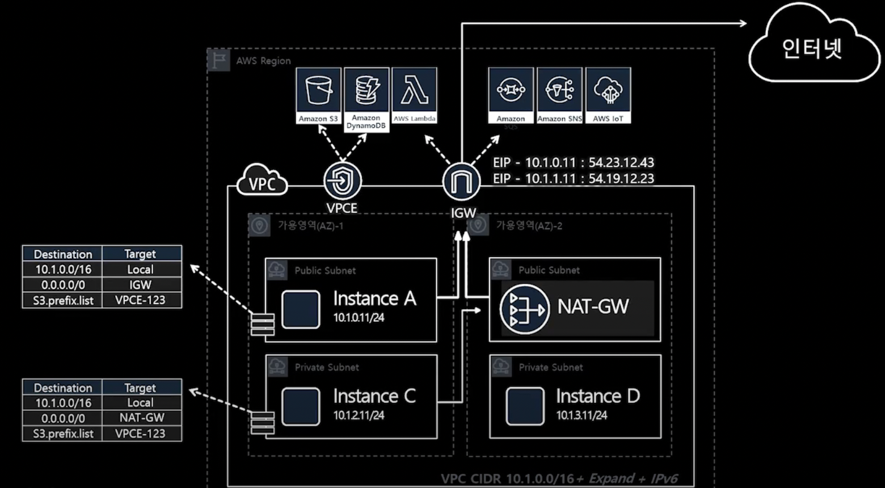
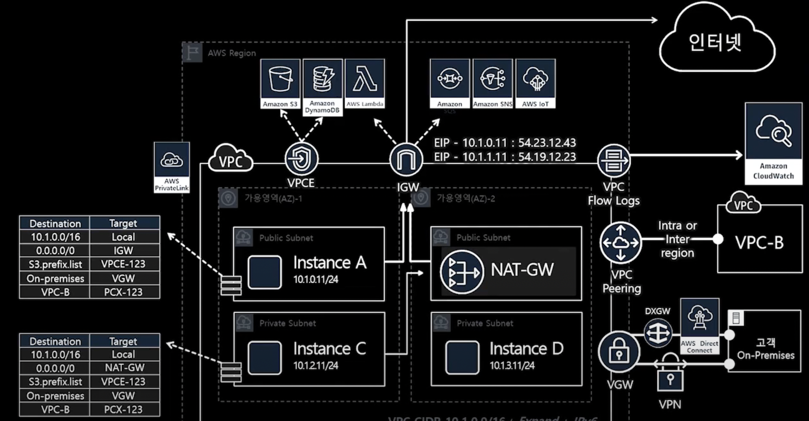
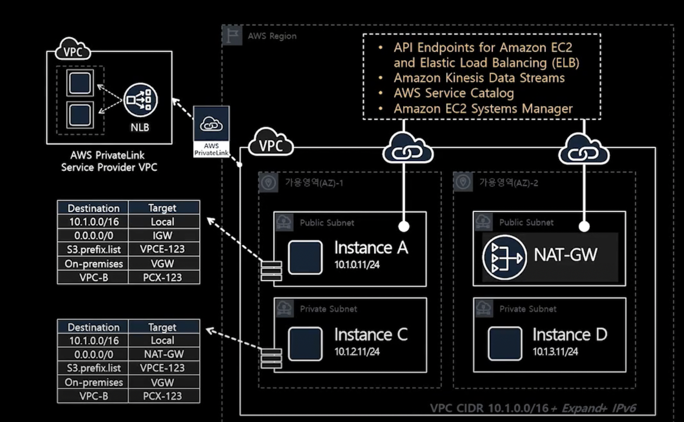
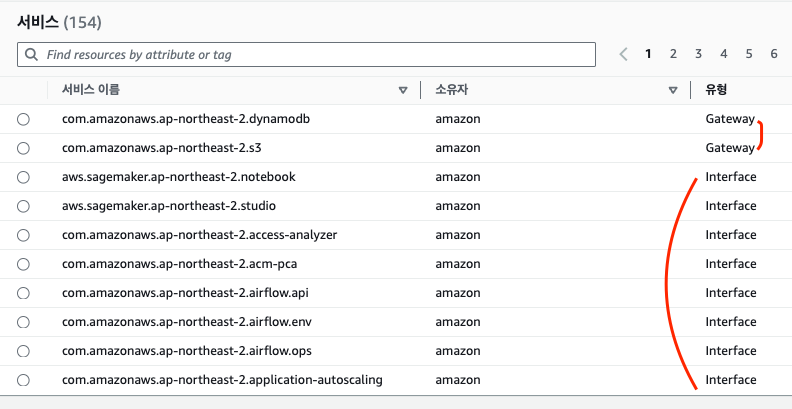
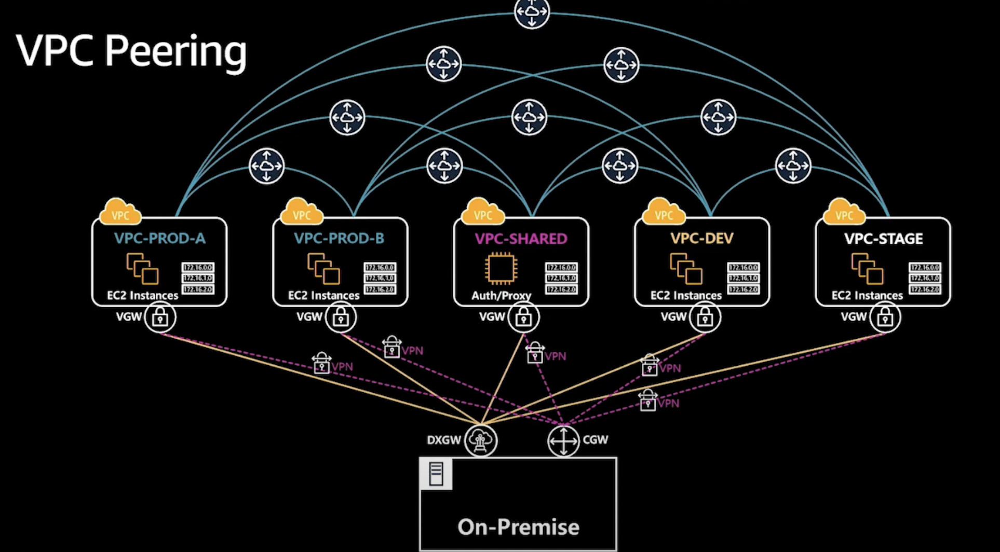
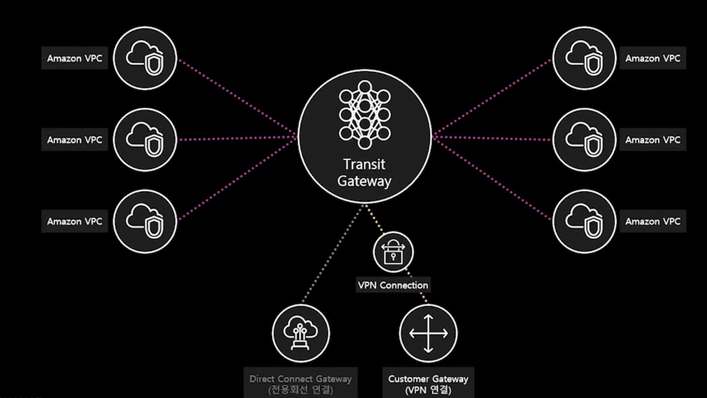
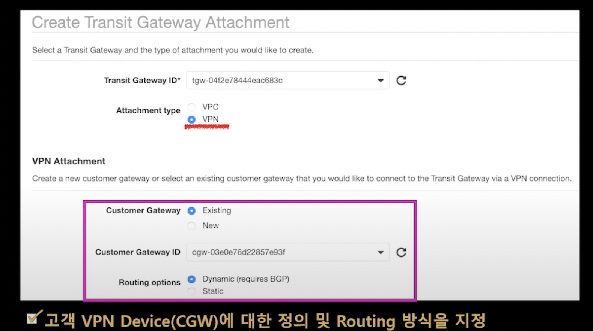

# Multi-Private-VPC

## Execute Terraform

```sh
   cd /infra

   ## 1. provider_profile 수정
   ## 2. ec2_key_path 수정

   terraform init
   terraform plan
   terraform apply

   ## Cleanup
   terraform destroy
```

## Single VPC



- VPC Endpoint를 사용하여 Nat-Gateway를 거치지 않고 바로 접근할 수 있음 (바로접근)
  - S3
  - DynamoDB

## Multi VPC (use VPC Peering)



- onPremise 환경내에서는 AWS Direct Connect로 연결
- 다른 VPC와의 연결은 VPC Peering을 활용
- 두개의 연결은 Routing Table로 기재

## use PrivateLink



- 결국에는 AWS Service 자체가 IGW를 통해서 외부로 연결이 된다.
- S3, DynamoDB는 VPC Endpoint로 대체가 된다.
- 나머지는 AWS PrivateLink를 사용을 하여 IGW, NAT를 거치지 않고 바로 사용가능하다
  - EC2
  - ELB
  - Kinesis Data Stream
  - Service Catalog
  - EC2 System Manager
  - more... (대부분 지원 예정)



- Gateway는 S3, DynamoDB => VPC Endpint
- 그 외는 VPC privateLink
- <a href="https://stackoverflow.com/questions/66726225/aws-private-link-vs-vpc-endpoint"> vpc endpoint vs vpc private link </a>

## VPC Transit-Gateway (Multi-Account + Multi VPC)



- 기존의 vpc peering을 사용하는 경우 (단점)
  - route table Resource Entires가 점점 많아지고 복잡함
  - vpc 계속 늘어날 경우 => 스케일이 커지면 굉장히 복잡해짐
  - VPC Route Table당 Entries가 최대 100개임...
  - 하나의 VPC당 Peering은 최대 125개임..



- 수 많은 VPC + onPremise Network를 쉽고 자유롭고 연결할 수 있음
- 자동적으로 Default TGW Routing Table에 Mapping이 됨



- onPremise network에서도 연결하기 위해서 VPN을 사용할 수 있다.
- Customer Gateway ID => onPremise Unique Id

## ISP vs BGP (Border Gateway Protocol) ?

## Reference

- <a href="https://www.youtube.com/watch?v=vEFh0BQ3iOk&t=1744"> Transit Gateway </a>
