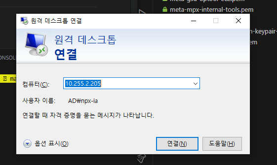

# 윈도우 로그인

## 일단 RDP로 접근은 해야 함



## 유저 할당 (어드민 그룹에 추가)

```
    Server Manager
    오른쪽상단 (Tools) -> Local User And Groups
    Users 추가
    Administrator Group에 추가된 user 할당
```

## 방화벽 모두 허용

```
    Windows Defender Fireall -> Turn Windows Defender Firewall on or off
```
